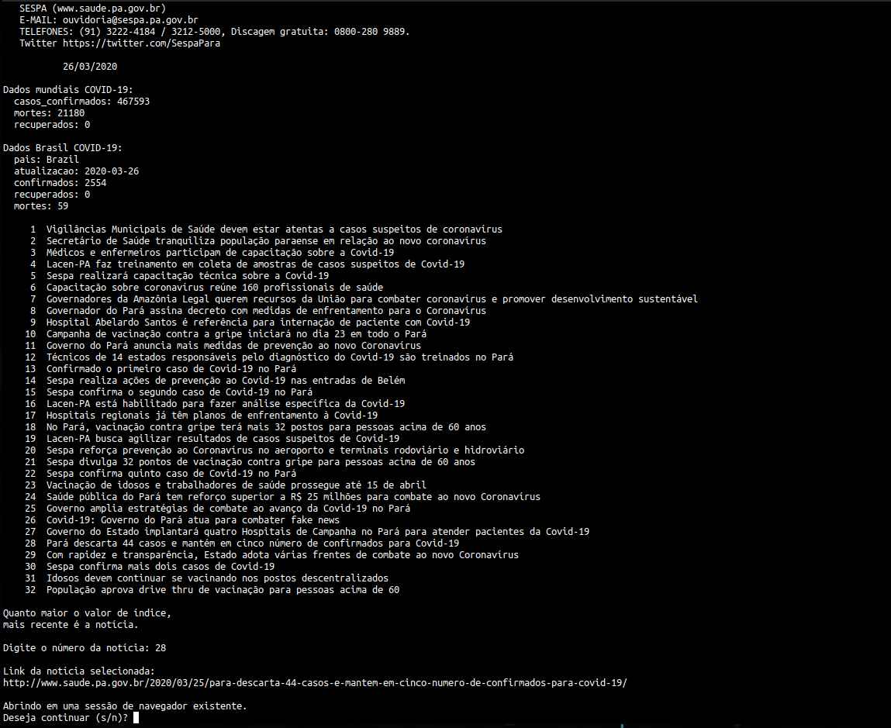

# Scripts_ShellScript_COVID_noticias_Sespa

Tem por finalidade oferecer de forma mais imediata noticias do site da SESPA via ShellScrip no Termianl Linux.


Observação: 
- No momento o navegador Google-chrome é pré requisito. Mas pode ser alterado no script.
- Para que a API funcione, é necessário que esteja instaldo o [jq](https://stedolan.github.io/jq/). ```sudo apt install jq``` 


